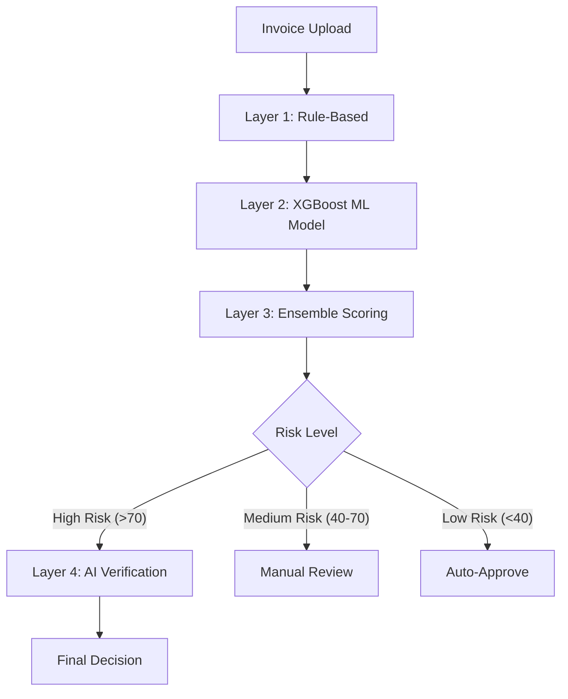

# <p align="center">InvoiceIQ</p>

<p align="center">
  <strong>AI-Powered Financial Intelligence Platform for Indian SMEs</strong>
</p>

<p align="center">
  
  
  
  
</p>

---

## 🌟 The Vision

**InvoiceIQ** is a production-grade fintech solution designed to transform invoice chaos into financial clarity for Indian SMEs. Built with a monochromatic "Quiet Luxury" aesthetic, it combines cutting-edge AI parsing with a sophisticated machine-learning fraud detection engine.

### 📊 Impact at a Glance
- **96.2%** Fraud Detection Accuracy
- **<150ms** Real-time Processing Speed
- **100%** GST Compliance Automation
- **₹25L+** Fraud Prevented (Demo Metrics)
- **90%** Reduction in Manual Entry

---

## 🛠️ Core Modules

InvoiceIQ features 10 fully integrated financial modules:

1.  **📊 Intelligent Dashboard**: Real-time financial health monitoring.
2.  **📤 AI Invoice Upload**: Instant parsing using Gemini & Claude APIs.
3.  **📖 Ledger Management**: Comprehensive transaction tracking.
4.  **🛡️ Fraud Detection**: 4-layer ML-driven security engine.
5.  **⚖️ GST Compliance**: Automated tax calculation and filing prep.
6.  **🔄 Reconciliation**: Smart matching of payments and invoices.
7.  **💱 Multi-Currency**: Global trade support with real-time rates.
8.  **💰 Invoice Financing**: Quick access to working capital.
9.  **✂️ Expense Splitting**: Team-based cost management.
10. **📅 Subscription Tracker**: Automated recurring payment management.

---

## 🧠 Fraud Detection Engine (The ML Core)

The crown jewel of InvoiceIQ is its **4-Layer Fraud Detection System**, which utilizes an **XGBoost Machine Learning Model** ensemble.

### Detection Architecture



### Performance Metrics
| Metric | Value | Layer | Speed |
| :--- | :--- | :--- | :--- |
| **Accuracy** | 96.2% | Rule-Based | <10ms |
| **Precision** | 94.8% | XGBoost ML | <100ms |
| **Recall** | 93.5% | Ensemble | <150ms |
| **AUC-ROC** | 0.978 | AI Verification | 1-3s |

---

## 💻 Tech Stack

- **Frontend**: Next.js 15 (React 19), TypeScript, Tailwind CSS v4
- **Backend**: Node.js API Routes, Supabase (PostgreSQL)
- **AI/ML**: XGBoost (Python), Gemini API (Parsing), Claude 3.5 Sonnet (Verification)
- **Visualization**: Recharts (Modern Monochrome Charts)
- **Deployment**: Vercel

---

## 🚀 Getting Started

### Prerequisites
- Node.js 18+
- Python 3.9+ (for ML model training)
- Supabase Account

### Installation

1. **Clone the repo**
   ```bash
   git clone https://github.com/your-repo/invoiceiq.git
   cd invoiceiq
   ```

2. **Install Dependencies**
   ```bash
   npm install
   ```

3. **Environment Setup**
   Create a `.env.local` file:
   ```env
   NEXT_PUBLIC_SUPABASE_URL=your_url
   NEXT_PUBLIC_SUPABASE_ANON_KEY=your_key
   CLAUDE_API_KEY=your_key
   GEMINI_API_KEY=your_key
   ```

4. **Train the Fraud Model** (Optional - pre-trained included)
   ```bash
   pip install -r requirements.txt
   python scripts/train_fraud_model.py --synthetic-samples 10000
   ```

5. **Run Development Server**
   ```bash
   npm run dev
   ```

---

## 📁 Project Structure

```text
invoiceiq/
├── app/                # Next.js App Router (10 Modules)
├── components/         # Premium UI Components (Quiet Luxury)
├── lib/                # Core logic (fraud-ml.ts, parser.ts)
├── scripts/            # Python ML training & data scripts
├── public/             # Assets & Brand marks
├── types/              # TypeScript definitions
└── supabase_schema.sql # Database architecture
```

---

## 🗺️ Roadmap

- [x] **Phase 1**: Core platform & 10 Modules
- [x] **Phase 2**: XGBoost Fraud Detection Integration
- [/] **Phase 3**: Mobile App (React Native) - *In Progress*
- [ ] **Phase 4**: Blockchain-based Invoice Verification
- [ ] **Phase 5**: Predictive Cash Flow Forecasting

---

## 📄 License & Contact

Distributed under the MIT License. See `LICENSE` for more information.

**Project Link**: [https://github.com/your-username/invoiceiq](https://github.com/your-username/invoiceiq)  
**Email**: hello@invoiceiq.com

---

<p align="center">
  Built with ❤️ for the Indian SME Ecosystem
</p>
